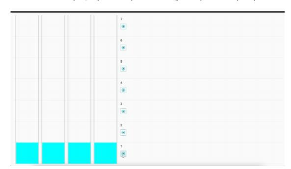

Тестовое задание для вакансии Junior Frontend Developer, TrueConf
«Эмулятор лифта»
Требуется разработать одностраничное приложение (SPA), эмулирующее работу
лифтовой системы.
Приложение должно состоять из схемы нескольких этажей с нумерацией и
кнопками вызова, а также из самой шахты лифта с кабиной.
Количество этажей по умолчанию: 5
Количество шахт лифта по умолчанию: 1
По умолчанию лифт находится на 1 этаже в состоянии покоя (свободен).
При нажатии на кнопку вызова лифт должен обработать этот вызов в
соответствии со следующими сценариями:
1 Если вызов осуществляется с этажа, на котором лифта нет – свободный
лифт начинает движение к выбранному этажу со скоростью 1 этаж в
секунду.
Достигнув нужного этажа лифт 3 секунды «отдыхает» - индикацию этого
состояния можно реализовать с помощью мигания.
После этого лифт снова переходит в состояние покоя и готов обработать
следующий вызов.
2 Если в момент движения лифта осуществить вызов на другой этаж – этот
вызов должен добавиться в очередь вызовов.
Вызовы должны обрабатываться последовательно.
3 Вызов пропускается в случаях, если:
- лифт уже находится на выбранном этаже в состоянии покоя
- лифт уже находится в процессе обработки такого вызова (находится в
движении к выбранному этажу)
- в очереди вызовов уже есть выбранный этаж
Также необходимо реализовать дополнительную обвязку, состоящую из
следующих задач:
1 Добавить табло индикации на кабину лифта, на котором в процессе
движения будет отображаться направление движения и целевой этаж.
2 Добавить индикацию кнопок вызова на этажах (например, смену цвета) в
случае, если:
- лифт уже находится в процессе обработки такого вызова (находится в
движении к выбранному этажу)
- в очереди вызовов уже есть выбранный этаж
3 Добавить сохранение состояния приложения (позиция лифта, очередь
вызовов и т.д.) при перезагрузке страницы – после перезагрузки
приложение должно возобновить работу с сохраненного состояния.

Расширенное задание:
1 Спроектировать приложение таким образом, чтобы его было легко
масштабировать (изменить количество этажей и лифтов).
Предполагается наличие конфигурационных параметров, настраиваемых в
одном месте (например, в отдельном файле или в корневом компоненте).
2 При наличии двух и более свободных лифтов вызов должен обработать
лифт, наиболее близко расположенный к целевому этажу.

Приложение должно быть написано с использованием фреймворка VueJS (2 или
3 версии). Приветствуется Webpack сборка со своим конфигом, но допускается
использование vue-cli или create-vue.
Приложение не должно иметь глобальных зависимостей (все зависимости
должны устанавливаться локально в папку с проектом).
Установка должна происходить по команде: npm install
Запуск должен происходить по команде: npm run start
Дизайн (стилистическое оформление) приложения остается на усмотрение
разработчика.
Выполненное задание нужно загрузить в публичный репозиторий на Github, и
отправить ссылку на него в ответном письме.
Работа оценивается по следующим критериям:
1 Соответствие реализации техническому заданию.
2 Компонентный подход (структура приложения).
3 Ведение git репозитория.
Подсказка: лучше разбивать реализацию поэтапно на логические коммиты, а не заливать
все сразу.
4 Правильность, чистота и стиль кода, отсутствие ошибок и
предупреждений при сборке и работе приложения.
Время, отведенное на выполнение: до 7 дней.
Удачи!